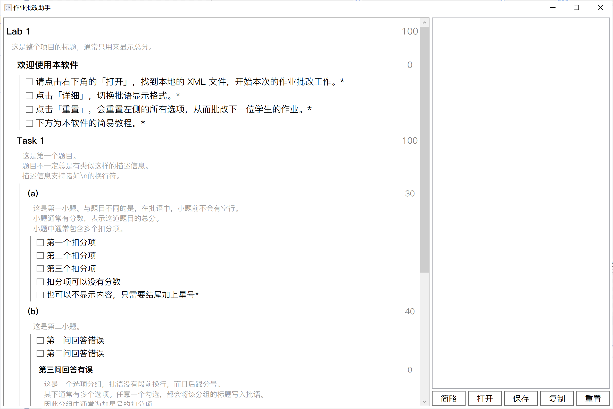

# 作业批改助手

这款 WPF 小软件或许会对大学助教群体有所帮助吧……



如果想要使用该软件，需要手动设置作业批语相关的 `.xml` 文件。上图所使用的模板如下：

```xml
<?xml version="1.0" encoding="utf-8" ?>
<task title="Lab 1" desc="这是整个项目的标题，通常只用来显示总分。">
    <task title="Task 1" desc="这是第一个题目。\n题目不一定总是有类似这样的描述信息。\n描述信息支持诸如\\n的换行符。">
        <subtask title="(a)" desc="这是第一小题。与题目不同的是，在批语中，小题前不会有空行。\n小题通常有分数，表示这道题目的总分。\n小题中通常包含多个扣分项。" score="30">
            <check title="第一个扣分项" score="-10"/>
            <check title="第二个扣分项" score="-10"/>
            <check title="第三个扣分项" score="-10"/>
            <check title="扣分项可以没有分数"/>
            <check title="也可以不显示内容，只需要结尾加上星号*"/>
        </subtask>
        <subtask title="(b)" desc="这是第二小题。" score="40">
            <check title="第一问回答错误" score="-10"/>
            <check title="第二问回答错误" score="-10"/>
            <group title="第三问回答有误" desc="这是一个选项分组，批语没有段前换行，而且后跟分号。\n其下通常有多个选项。任意一个勾选，都会将该分组的标题写入批语。\n因此分组中通常为加星号的扣分项。">
                <check title="扣分的第一个原因*" score="-10"/>
                <check title="扣分的第二个原因*" score="-5"/>
                <check title="扣分的第三个原因*" score="-5"/>
            </group>
        </subtask>
        <subtask title="(c)" desc="下面的项目的分数可以自行编辑，也可以用滚轮快速调节。">
            <mark title="整体印象分(0~10)" score="8" range="0,10"/>
        </subtask>
    </task>
</task>
```

# XML 元件介绍

## 容器

容器包含三种，分别为`Task`，`Subtask`和`Group`。

这三种容器其下都可以包含任意多的任何元件。

### Task

```xml
<task title="Task Title" score="0" desc="Description" />
```

`Task`通常指**大题**。在输出批语时，`Task`的标题前会有额外的空行，用来和其他`Task`隔开。

因为`Task`的分数一般由其下的小题分数加和得到，所以通常这里分数设置为`0`，或者不用设置，默认为`0`。

### Subtask

```xml
<subtask title="Subtask Title" score="30" desc="Description" />
```

`Subtask`通常指**小题**。在输出批语时，`Subtask`的标题前不会有额外的空行。从格式上看，它属于某个`Task`。

本软件最推荐的方法是扣分制，因此推荐`Subtask`包含分数，其下的元件的分数为负数（其下元件的和的绝对值最好与`Subtask`的分数相同，但并不强制要求）。

### Group

```xml
<group title="Group Title" score="0" desc="Description" />
```

`Group`一般用于评分项的分组。在输出批语时，`Group`的标题前不会有额外的空行，其后也会像普通打分项那样，用分号与下文分隔。

`Group`一般这样使用：

```xml
<group title="回答不够充分" score="0" desc="Description">
	<check title="没有考虑第一种情况" score="-3"/>
	<check title="没有考虑第二种情况" score="-3"/>
	<check title="没有考虑第三种情况" score="-4"/>
</group>
```

这样在生成批语时，不会生成过于详尽或复杂针对单个小题的评语。

## 打分项

打分项分三种，分别为`CheckBox`，`RadioButton`和`MarkBox`。打分项没有`desc`，但是有`ischecked`属性。

### CheckBox

```xml
<check title="回答错误" score="-10" ischecked="False"/>
```

`CheckBox`为一个复选项。只有在勾选时才会将对应的标题显示在批语中。

`ischecked`默认为`False`。如果为`True`，则默认被勾选。

### RadioButton

`RadioButton`为单选项（很少会使用这个元件），只有在被选中时才会显示在批语中。

因为单选项需要出现在同一个容器中，才能出发单选效果，因此如果要使用`RadioButton`，最好将其单独放在一个`Subtask`或`Group`中。例如：

```xml
<subtask title="第一小题">
	<radio title="完全正确*" score="20" ischecked="true"/>
	<radio title="基本正确" score="15"/>
	<radio title="部分错误" score="10"/>
	<radio title="明显错误" score="5"/>
	<radio title="完全错误" score="0"/>
</subtask>
```

只有需要这种递进的批语时才建议使用`RadioButton`，否则一般请使用下面要讲到的`MarkBox`。

### MarkBox

```xml
<mark title="卷面分数" range="0,5" score="5" ischecked="false"/>
```

`MarkBox`为一个打分项，由开头的复选框决定其对应批语是否在输出中呈现。

`score`表示默认分数。如果不写，则默认为`range`的最大值。
